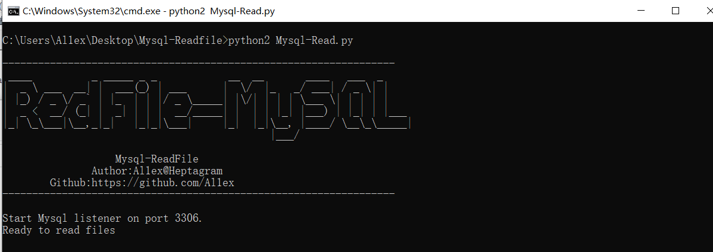
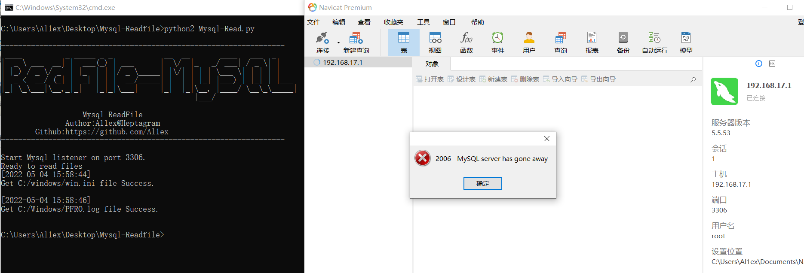

## Introduction

This project mainly uses load data local infile to obtain any files of the attacker's host (Windows platform), and the files to be visited can be listed in file.txt This will be very meaningful when we can control the connection configuration of Mysql in some cases.

## Project usage
Step 1:start Fake Mysql server

``` python2 Mysql-Read.py ```



Step 2:Connect malicious server



## Referer

https://mp.weixin.qq.com/s/rQ9BpavBeMnS6xUOidZ5OA

https://mp.weixin.qq.com/s/m4I_YDn98K_A2yGAhv67Gg
